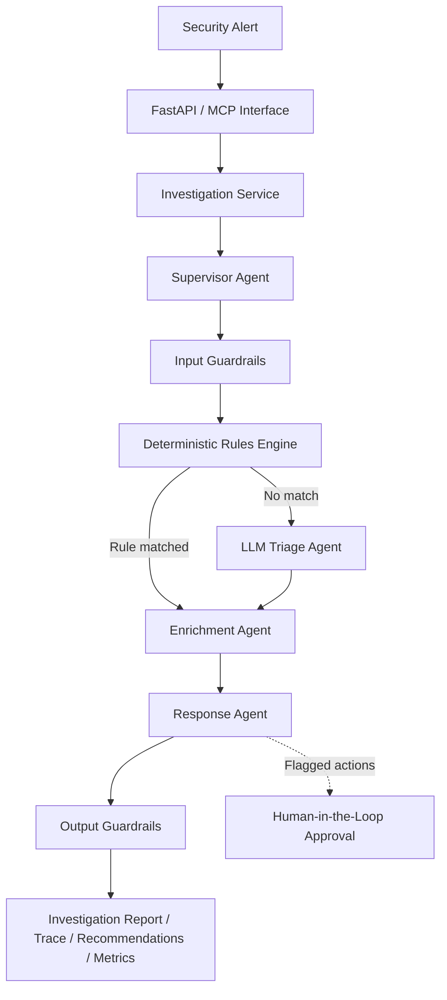

# AI SOC Alert

## Overview

Security alert investigation requires classifying severity, interpreting indicators, and deciding what an analyst should review next. AI SOC Alert is a multi-agent incident investigation platform that turns an alert into a structured report with reasoning, recommendations, and an investigation trace.

A supervisor coordinates deterministic rules, LLM triage, enrichment, and response planning. Input and output guardrails, call and token budgets, audit records, and a human approval workflow provide governance around that process.

The engineering system separates orchestration, model access, validation, storage, and delivery through FastAPI and the Model Context Protocol (MCP). Local fixtures, automated tests, and a golden-alert evaluation harness support repeatable development. Response actions are recommendations; the system does not execute remediation.

## Architecture



The diagram shows the main investigation path. Enrichment runs for medium-or-higher severity; response planning runs for high or critical severity, subject to budgets. Blocked input and high-confidence false positives return early. Approval requests are created during response planning, before output checks; reports return without waiting for an approval decision.

## Design Principles

- **Rules before escalation:** Classify known patterns deterministically; use LLM triage when no rule matches.
- **Structured, checked outputs:** Request JSON, build Pydantic report models, and apply targeted output checks.
- **Bounded autonomy:** Check call and token budgets before each agent stage; return recommendations for review.
- **Human approval for high-risk actions:** Queue high-risk or critical recommendations when flagged as requiring approval.
- **Observability and evaluation:** Record traces, decisions, usage, and latency; evaluate against golden alerts.

## Core Capabilities

- Supervisor-led triage with severity, confidence, reasoning, and MITRE ATT&CK mapping.
- Rules for known attack tools, benign scanner activity, and certificate lifecycle events.
- LLM-based enrichment of IPs and file hashes; a separate MCP lookup tool uses an injectable fixture provider for IPs, domains, and hashes.
- Response playbooks with risk levels and approval requests, plus HTTP endpoints to approve or reject requests.
- Input checks for injection patterns and description length; output checks for unexpected narrative IPs, suspicious severity downgrades, invalid confidence, and missing action targets.
- JSON logs, investigation traces, token/call accounting, and golden-alert evaluation.

## Quick Start

Requires Python 3.10+ and `uv`. From the repository root:

```bash
uv sync --locked
cp -n .env.example .env
OPENAI_API_KEY=demo-key uv run uvicorn main:app --reload
```

Open [API docs](http://localhost:8000/docs) and submit `POST /alerts/investigate` with:

```json
{
  "source_tool": "manual",
  "description": "Mimikatz execution on WORKSTATION-042",
  "hostname": "WORKSTATION-042",
  "process_name": "mimikatz.exe"
}
```

Demo mode uses local fixtures without an API key. The copy command preserves an existing `.env`; the startup command explicitly selects demo mode.

## Repository Layout

```text
main.py                      FastAPI application entry point
backend/app/api/             HTTP routes
backend/app/agents/          Supervisor, triage, enrichment, and response agents
backend/app/core/            Configuration, LLM client, logging, and rules
backend/app/evals/           Golden alerts and evaluation harness
backend/app/governance/      Budgets, permission policies, audit, and approvals
backend/app/guardrails/      Input and output checks
backend/app/integrations/    MCP server and connector abstractions
backend/app/investigations/  Investigation service and in-memory store
backend/tests/               API, governance, guardrail, observability, and MCP tests
```

## Runtime Interfaces

### FastAPI

Start the HTTP service with `uv run uvicorn main:app --reload` (or the demo command above).

| Endpoint | Purpose |
| --- | --- |
| `POST /alerts/investigate` | Investigate an alert |
| `GET /investigations/{investigation_id}` | Retrieve a report |
| `GET /approvals/pending` | List pending approvals |
| `POST /approvals/{request_id}/approve` | Record approval |
| `POST /approvals/{request_id}/reject` | Record rejection |
| `GET /health` | Return mode and LLM usage counters |

### MCP Server

Start the stdio server for an MCP host:

```bash
uv run python -m backend.app.integrations.mcp_server
```

Tools: `investigate_alert`, `lookup_threat_intel`, and `get_investigation`.

The included [VS Code configuration](.vscode/mcp.json) defines `soc-investigator`. Update its absolute `command` and `--directory` paths for your machine before starting it.

## Investigation Flow

1. FastAPI or MCP validates the request and builds an `Alert`; the shared service invokes the supervisor.
2. Input guardrails check the description before model access. Blocked alerts return for human review.
3. Rules classify known patterns; unmatched alerts use LLM triage if budget permits. High-confidence false positives close early.
4. Eligible alerts proceed through enrichment and response planning. Actions marked `requires_approval` enter the approval workflow; high-risk and critical requests remain pending.
5. Output guardrails check the report and flag failures for review. The service stores and returns the report, trace, recommendations, and usage metrics.

## Configuration

Settings load from environment variables and `.env`.

| Setting | Default / behavior |
| --- | --- |
| `OPENAI_API_KEY` | `demo-key` selects fixtures; a real key enables live LLM calls |
| `LLM_MODEL` | `gpt-4` |
| `MAX_TOKENS_PER_INVESTIGATION` | `5000`; checked before each agent call |
| `MAX_LLM_CALLS_PER_INVESTIGATION` | `15`; checked before each agent call |

`LLM_TEMPERATURE`, `MAX_TOOL_CALLS_PER_INVESTIGATION`, `LOG_LEVEL`, and `DB_PATH` are declared but currently do not control runtime behavior. Token accounting happens after a call, so the final call can exceed the token threshold.

## Testing

Run tests and evaluation with repeatable local fixtures:

```bash
OPENAI_API_KEY=demo-key uv run pytest
OPENAI_API_KEY=demo-key uv run python -m backend.app.evals.evaluate
```

For MCP routing tests only:

```bash
OPENAI_API_KEY=demo-key uv run pytest backend/tests/test_mcp_server.py
```

The evaluation prints severity and decision-source accuracy, report field checks, review rates, guardrail blocks, token usage, and latency. Demo token counts are fixture values.

## Docker

With Docker and Docker Compose installed and running, run from the repository root:

```bash
cp -n .env.example .env
docker compose up --build
```

Compose loads `.env`; the example selects `OPENAI_API_KEY=demo-key`. To force demo mode even with an existing key, use `OPENAI_API_KEY=demo-key docker compose up --build`.

The image installs dependencies from `uv.lock` and starts Uvicorn on `0.0.0.0:8000`, mapped to host port `8000`. Open [API docs](http://localhost:8000/docs). The health check uses Python's standard library to check `GET /health`, without requiring `curl` in the image.

In another terminal, check container status and the health response:

```bash
docker compose ps
docker compose exec api python -c "import urllib.request; print(urllib.request.urlopen('http://localhost:8000/health', timeout=3).read().decode())"
```

Expect `status: healthy` and, when using `demo-key`, `mode: demo` in the JSON response. Stop and remove the container with `docker compose down`.

## Engineering Notes

- **Storage:** Reports, approvals, and audit records are process-local. Separately launched API and MCP processes do not share state; restarts clear it.
- **Enrichment:** Investigation enrichment is generated by the LLM or demo fixtures. MCP threat lookup defaults to fixtures. Vendor names in prompts and fixtures do not represent live integrations.
- **Governance:** Permission policies exist and are tested separately, but the supervisor does not invoke them. Approval records do not execute actions or update action approval fields in stored reports.
- **Validation:** Guardrails are targeted checks, not comprehensive validation of model output. Early returns skip later stages and may leave latency at its default value.
